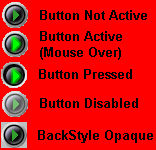



## Active Button

### Description

This control DOES NOT use Timer and is an active button with following parameters you can set:

Image when mouse is over,

Image when button is up,

Image when button is down,

Image when button is disabled,

BackStyle - transparancy according to Mask Color,

MaskColor - what color on image will be transparent,

Style - standard button or check button,

Value - set/return either button is pressed or released,

and other.

It works just like toolbar button except it does not have a frame and you can specify all the images. This is a new version with bug fixed.
 
### More Info
 
The main idea of the button is to set mouse capture. You can see it in source codes or just use compiled OCX.

If you would find any, let me know

             |
---                |---
**Submitted On**   |2000-10-24 12:33:32
**By**             |[Gene Martynov](https://github.com/Planet-Source-Code/PSCIndex/blob/master/ByAuthor/gene-martynov.md)
**Level**          |Intermediate
**User Rating**    |4.5 (89 globes from 20 users)
**Compatibility**  |VB 4\.0 \(32\-bit\), VB 5\.0, VB 6\.0
**Category**       |[OLE/ COM/ DCOM/ Active\-X](https://github.com/Planet-Source-Code/PSCIndex/blob/master/ByCategory/ole-com-dcom-active-x__1-29.md)
**World**          |[Visual Basic](https://github.com/Planet-Source-Code/PSCIndex/blob/master/ByWorld/visual-basic.md)
**Archive File**   |[CODE\_UPLOAD1093210242000\.zip](https://github.com/Planet-Source-Code/gene-martynov-active-button__1-12218/archive/master.zip)

